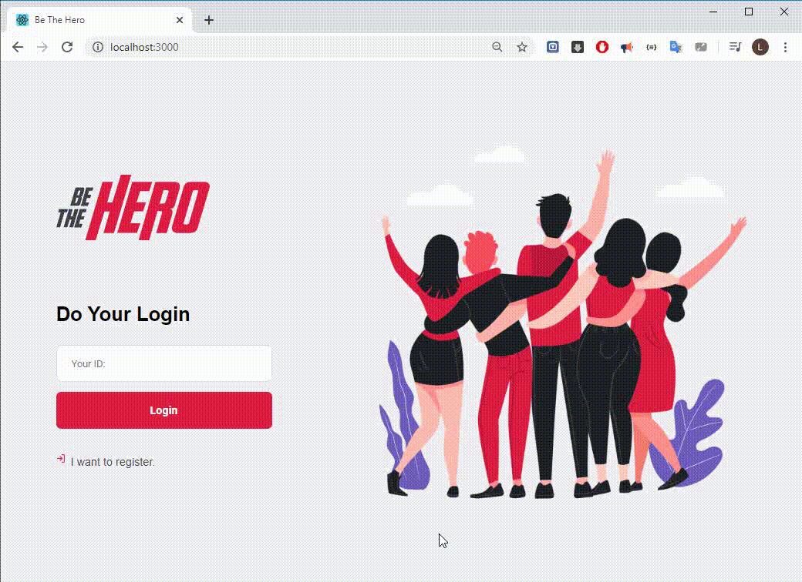

### The FrontEnd was developed using REACT JS.

#### System running example:

### Install:

You can install by cloning this repository and running "npm install" inside frontend directory.

### Running:

You can start the frontent module running "npm start" on a terminal, in the frontend directory.

##### OBS: The backend module needs already running to provide the frontend communications.