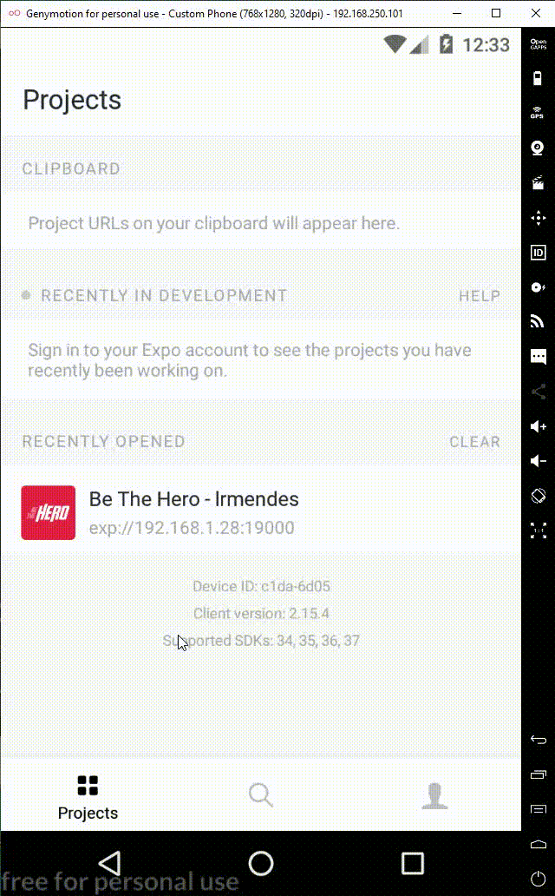

### The Mobile Module was developed using REACT NATIVE / EXPO.

#### System running example:

### Install:

You can install by cloning this repository and running "npm install" inside mobile directory.

### Running:

You can start the mobile module running "expo start" on a terminal, in the mobile directory.

##### OBS: The backend module needs already running to provide the mobile communications.